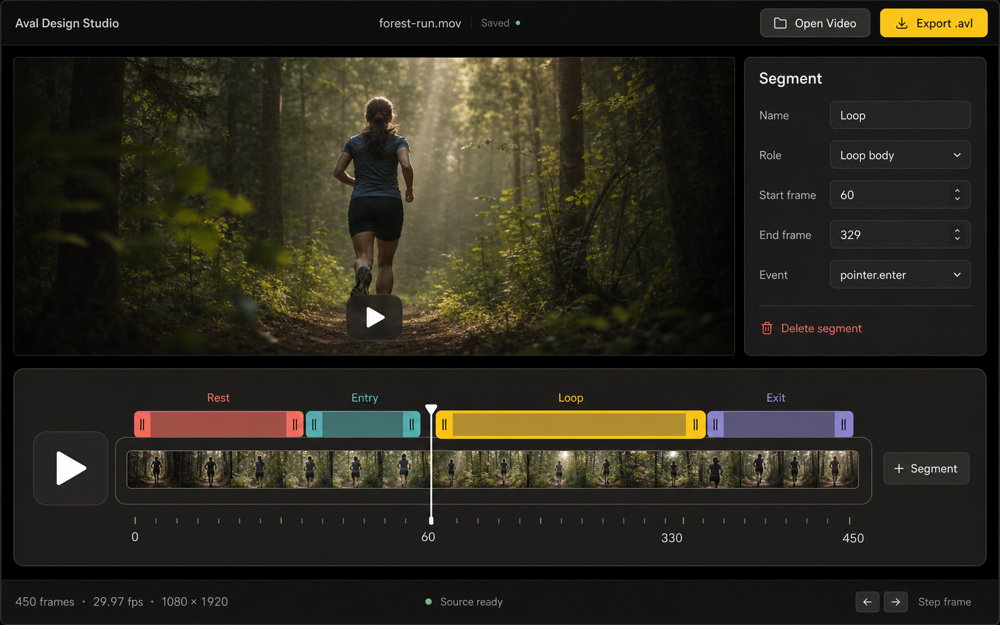

# AVAL Design Studio

[](https://github.com/mckay115/aval-design-studio/actions/workflows/ci.yml)
[](https://www.zachlisko.com/aval-design-studio/)
[](LICENSE)

AVAL Design Studio is a local-first Tauri and React editor for turning source video into state-driven [AVAL](https://github.com/pixel-point/aval) 1.0 bundles.

The editor uses [MediaBunny](https://mediabunny.dev/) for container inspection, source metadata, frame-accurate Canvas preview, seeking, and thumbnail extraction. The final bundle boundary remains the official AVAL compiler; Studio does not implement a competing `.avl` encoder.

**Technical preview:** the project is pre-1.0. The document format, authoring workflow, and release packaging are expected to evolve with real-world feedback.

- [About and downloads](https://www.zachlisko.com/aval-design-studio/)
- [Latest desktop release](https://github.com/mckay115/aval-design-studio/releases/latest)
- [Upstream AVAL format and runtime](https://pixelpoint.io/aval/)



## Install the desktop app

Download the latest installer for macOS, Windows, or Linux from [GitHub Releases](https://github.com/mckay115/aval-design-studio/releases/latest). Release builds include the pinned AVAL compiler, Node runtime, FFmpeg, and FFprobe. Tauri verifies signed update artifacts from the same GitHub Releases feed and offers later versions inside the app.

## Workflow

1. Import a local file without an extension allowlist. MediaBunny reads supported web containers directly; the reviewed desktop toolchain can normalize other video formats.
2. Review Source Prep. Compiler-ready MOV/MP4/M4V sources pass through; other formats receive a remux or ProRes normalization plan.
3. Author semantic states, units, routes, and bindings on exact half-open frame ranges.
4. Preview the complete source, one unit, or interactive state changes using MediaBunny timestamps.
5. Save an editable `*.avalstudio.json` Studio v3 document.
6. In the desktop app, choose Balanced Web, Fast Draft, or Custom and build codec-specific `.avl` assets plus `build.json`.

Browser development builds deliberately disable compilation. Distributed desktop builds include the pinned AVAL compiler, its private Node runtime, FFmpeg, and FFprobe; users do not install sidecars. Each release fails closed unless all four reviewed AV1, VP9, H265, and H264 encoders and complete provenance are present.

## Development

Requirements: Node.js 22.12+, pnpm 10.33+, stable Rust, and the [Tauri platform prerequisites](https://v2.tauri.app/start/prerequisites/).

```sh
pnpm install
pnpm check
pnpm tauri:dev
```

For frontend-only work:

```sh
pnpm dev
```

## Architecture

- `src/model/studio.ts` and `src/model/graphOperations.ts` own the deterministic Studio v3 model, graph mutations, AVAL 1.0 projection, validation, and reviewed encoding profiles.
- `src/hooks/useMediaSession.ts` owns transient MediaBunny inputs, decoders, timestamp playback, cancellation generations, and thumbnails.
- `src/components/` renders the states-first editor, source-prep review, timeline, unit inspector, and build drawer.
- `src-tauri/` owns updater safety, packaged tool discovery, staging, fallback normalization, and compiler invocation.
- `sidecar/` defines JSONL protocol v2 and a Node-side MediaBunny probe host for packaging/toolchain development.

See [Architecture](docs/architecture.md), [Studio project format](docs/project-format.md), and [Toolchain and licensing](docs/toolchain.md).

## Community

Bug reports and focused feature requests are welcome in [GitHub Issues](https://github.com/mckay115/aval-design-studio/issues). Read [CONTRIBUTING.md](CONTRIBUTING.md) before a large format or workflow change, use [SUPPORT.md](SUPPORT.md) to choose the right tracker, and report vulnerabilities through the private process in [SECURITY.md](SECURITY.md).

## Scope and limitations

- AVAL 1.0 is sRGB and excludes audio, subtitles, and data tracks.
- Broad import means local media that MediaBunny or the packaged FFmpeg build can identify and decode; DRM, live/network/HLS input, and raw streams needing custom demux flags are excluded.
- MediaBunny transparency detection is preliminary. The AVAL compiler performs the authoritative full-frame alpha audit.
- The canonical AVAL packages are built from the exact upstream commit pinned in `toolchain/versions.json`; no compiler code is downloaded at runtime.

Studio source is MIT licensed. MediaBunny is MPL-2.0. Bundled media executables retain their own licenses and release requirements; see [Third-party notices](THIRD_PARTY_NOTICES.md).
